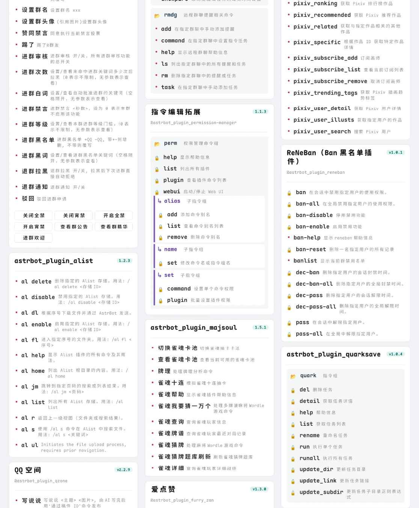
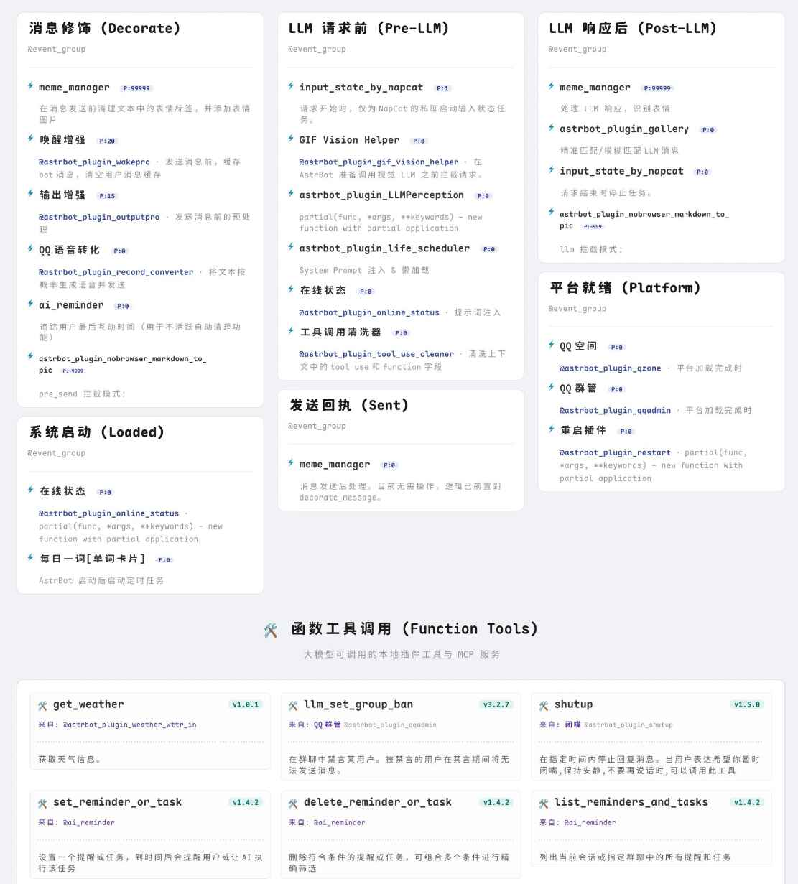
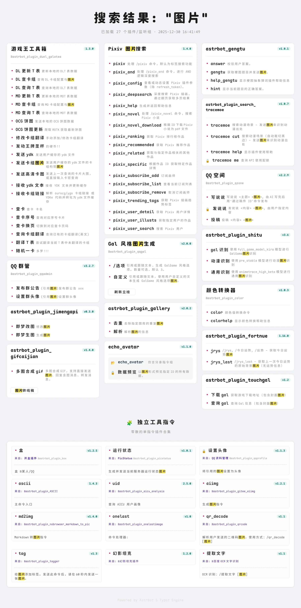

# 📂︎ Astrbot Plugin Help Typst | 插件菜单(typst实现)

<div align="center">

[](https://github.com/Soulter/AstrBot)
[](https://www.python.org/)
[](./LICENSE)
[]()

** 以优雅的方式组织你的插件菜单 **
<br>
*轻量  丰富  更多🗃*

</div>

---

## 📖 简介
* 基于 tinkerbellqwq/astrbot_plugin_help 进行重度开发的插件菜单，实现缓存功能
* 把插件菜单、事件钩子、函数工具、过滤器列表渲染成友好界面，智能组织节点和分组，并附上丰富的元信息。不只是面向 bot 用户的说明，也是一份调试辅助工具。
* 针对插件名、指令名、描述内容的泛用搜索工具，附关键词高亮【用法： helps/events/filters <关键词>】
* 基于 typst 渲染实现，轻量、灵活、高效，你可以使用 typst 语法修改、构建属于自己的渲染模板（WIP）
* 支持自定义字体 .ttf .otf .woff2<br>
1.放入 插件目录/resources/fonts 或[自定义字体目录](#-常见问题)<br>
2.重载方式三选一(更新 optional scheme)<br>
2a.在 AstrBot 面板中重载插件<br>
2b.重启 AstrBot<br>
2c.使用指令 typst font<br>
3.新字体将会出现在配置面板供 勾选 & 排序 (不可用的字体会被自动剔除)

<br>进度：基本功能 √

## 🖼️ 功能预览

| `插件菜单` | `事件监听器` |
| :---: | :---: |
|  |  |


| `过滤器` | `搜索` |
| :---: | :---: |
|  |  |

## 🧱 依赖
AstrBot>=4.10.4<br>
typst>=0.14.7<br>
pydantic

## 🤝 感谢 PR
Zhalslar(饰乐)  https://github.com/Zhalslar

## ✔ 计划清单
* 配置-自定义项目
* 配置-背景 working...
* 配置-模板 working...
* ~~功能-黑名单~~
* 指令-黑名单管理
* 正式的说明文档

## ❓ 常见问题

### Typst 字体优先级
文档显式指定 > 项目字体目录 > 系统字体库
* 文档显式指定：通过 #set text(font: "font-family-name") 直接指定，优先级最高
* 项目字体目录：即本插件的根目录下的 ./resources/fonts <br>
~~后面会考虑增加额外的目录支持~~已完成，缺省值为 `.../data/plugin_data/astrbot_plugin_help_typst/fonts` 🚨 docker 用户记得确保自定义字体目录已被挂载
* 系统字体库：获取系统默认字体目录 ( Windows、macOS 应该有官方支持，Linux 未测试支持度如何；🚨 docker 环境可能需要安装字体依赖）

## 🌳 目录结构（初步预期）
```
astrbot_plugin_typst_menu/
├── main.py                # [入口] AstrBot 插件主文件，注册指令和事件，转发给 core
├── domain/                # [数据定义层] (最底层，无依赖)
│    ├── constants.py          # 存储 “魔术数字” 统一于此维护调试
│    ├── config.py             # 配置结构
│    └── schemas.py            # Pydantic Models & TypedDicts
├── utils/                 # [通用工具层] (各类公开可复用的静态方法)
│    ├── hash.py               # hash
│    ├── font.py               # 字体扫描 & 管理
│    ├── image.py              # 图片处理
│    └── views.py              # [视图层] 处理通过指令组管理和调试插件时展示给用户的格式化文本
├── core/                  # [核心业务层] (纯 Python 逻辑)
│    ├── analyzer.py           # 获取、组织数据
│    ├── renderer.py           # 渲染调度
│    └── worker.py             # 进程调用（即用即销）
├── templates/             # Typst 模板文件
│    └── base.typ              # 基础库文件 (类似 CSS Reset)
└── resources/             # 静态资源
     ├── fonts/                # 内置开源中文字体
     └── images/               # 默认背景图、图标 (未完成)

```

---

<div align="center">
🔔 Merry Christmas~<br>
Made with 😊 by LilDawn
</div>